# Configuration, Implementation and Testing of UFW Firewall in Linux
---
## Introduction 

UFW (Uncomplicated Firewall) is a user-friendly firewall tool used in Linux to control network traffic.
It helps protect the system by allowing only trusted connections and blocking unauthorized access.

### Firewall Concepts Used:

| Configuration Terms | Description|
|--------------------|--------------|
| Incoming Traffic | Incoming rules control what others can access on the system. |
| Outgoing Traffic | Outgoing rules control what the system can access on the network. |
| Default Policies |  Incoming: Deny (Restricts incoming traffic) |
| | Outgoing: Allow (Packets can be sent from our end.<br>Ex : Can browse,connect,share information.)<br>This ensures better security by default. 


### This project demonstrates:

• Installation of UFW,Firewall ,Rule configuration,
  Testing and validation of rules

• Objective of the Project<br>
The main objectives of this project are:<br>
   • To configure UFW firewall in Linux<br>
   • To allow and block services using firewall rules<br>
   • To test firewall security by simulating attacks       
     on own system

## System Requirements:

| Component | Details |
|---------|------|
| Operating System | Linux (Ubuntu or Kali)|
| Firewall Tool | UFW |
| Services Tested | SSH, HTTP(Apache), FTP|


## Installation of UFW:
### Step 1: Update the packages (Ignore sudo if you're root).
UFW is installed using the package manager.
```
sudo apt update
```
### Step 2: Install ufw firewall.
```
sudo apt install ufw
sudo ufw --version
```
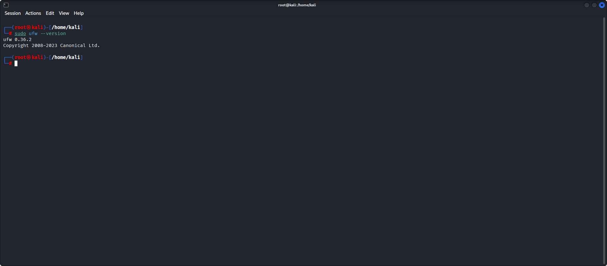
### Step 3: Start the ufw service.
```
sudo systemctl start ufw
sudo systemctl status ufw
```
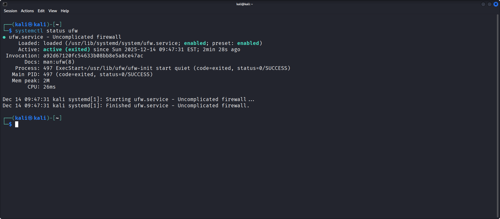
### Step 4: Check the status of the firewall.
``` 
sudo ufw status verbose 
```
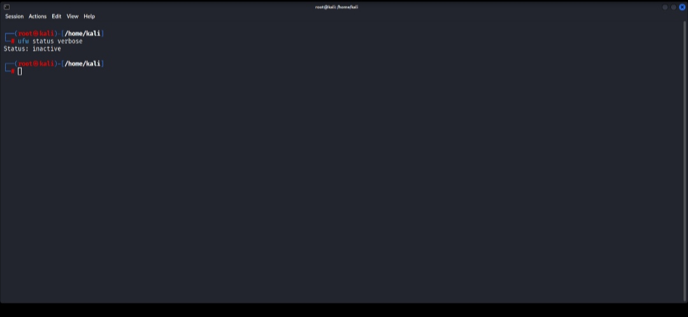
_It is showing inactive, because we haven't enabled it yet._
### Step 5: Enable the firewall.

Firewall is enabled to start protecting the system.
```
sudo ufw enable
```
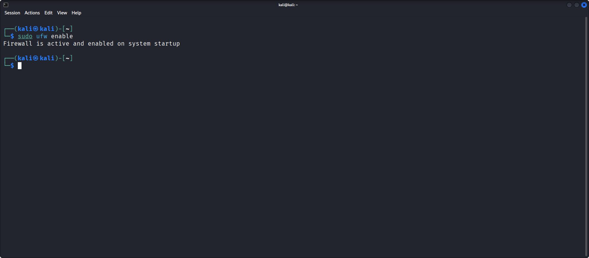
### Step 6: Check the status of your firewall.

```
sudo ufw status verbose 
```
_Status is verified after enabling and it will show active_.
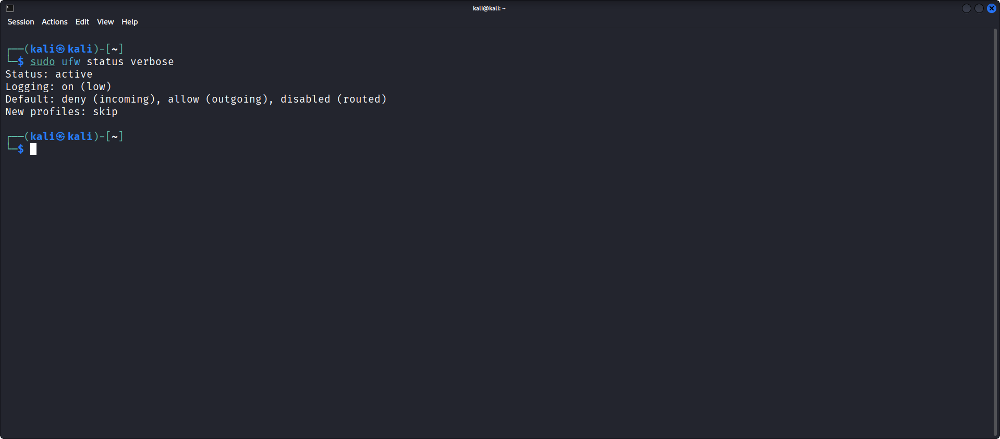
### Step 7: Deny/Block the incoming traffic to your system.

```
sudo ufw default deny incoming
```
### Step 8: Allow outgoing traffic so that we can use it as one-way communication.

```
sudo ufw default allow outgoing
```
### Rules Configuration :
_SSH,FTP and web access are allowed._
__You can allow the ports you want,in my case I allowed these three and some random services.__
```
sudo ufw allow 22/tcp
```
```
sudo ufw allow 80/tcp
```
```
sudo ufw allow 21/tcp
```

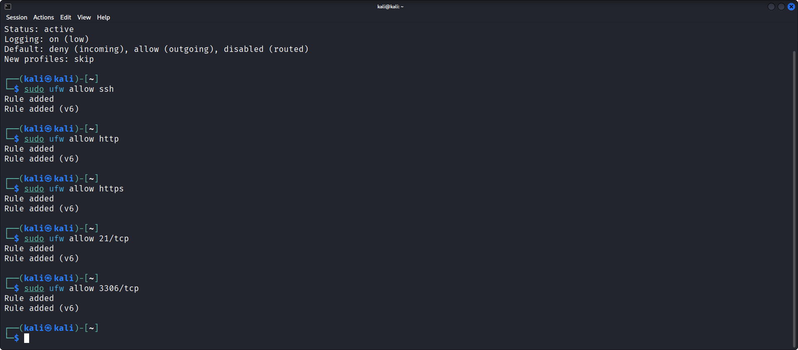
### Check the firewall status again.
```
sudo ufw status verbose 
```

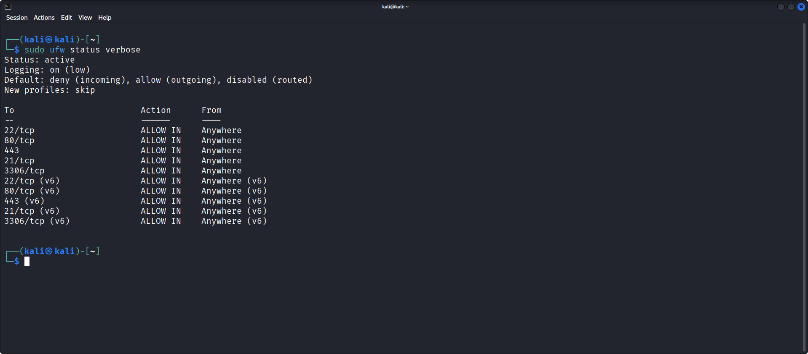


## Allowing & Denying the range of ports:
_UFW allows you to deny/allow the range of ports._
_Here I denied the ports from 500 to 65535 ,which are not useful for me._
```
sudo ufw deny 500:65535/tcp
```
_Check the status again._
```
sudo ufw status verbose 
```
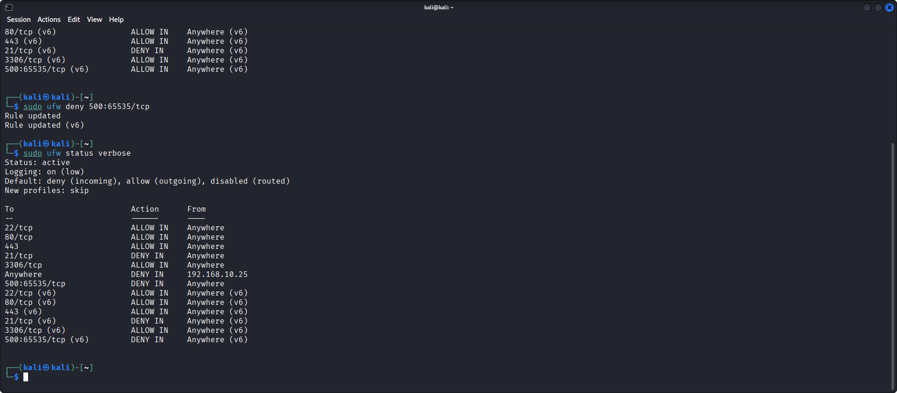
## Denying the specific port in ufw.

```
sudo ufw deny 21/tcp
```
## Denying the services for a particular IP address.
```
sudo ufw deny from 192.168.10.25
```
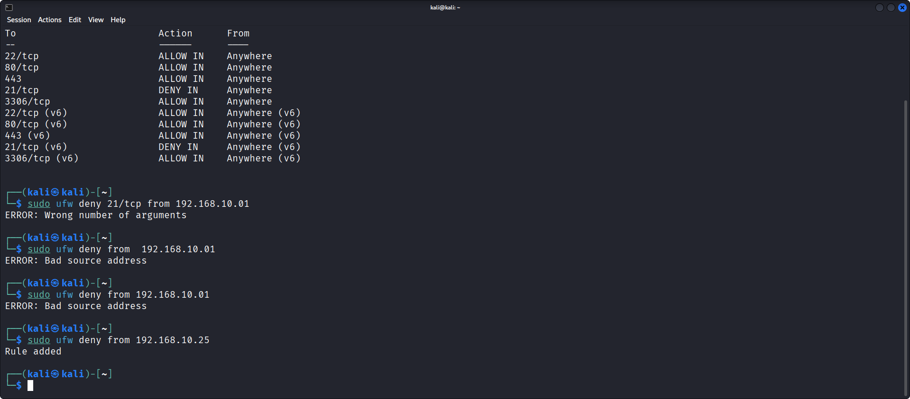
```
sudo ufw status verbose 
```
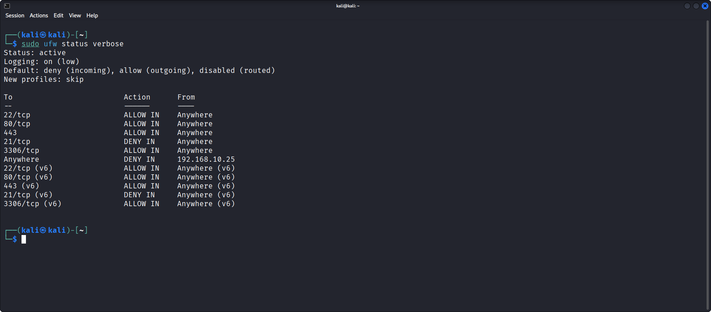
## Deleting a rule in the firewall:
```
sudo ufw status numbered
```
_This command lists the firewall rules in a numbered format._
__By referring the index number of the rule, delete whichever you want.__
_Ex:_ 
``` 
sudo ufw delete 3
```
_You can observe in first image there's a port 443/tcp which is https,and after deleting the rule 3 it's not in a list.

>1️⃣ _Before deletion._

2️⃣ _After deletion._
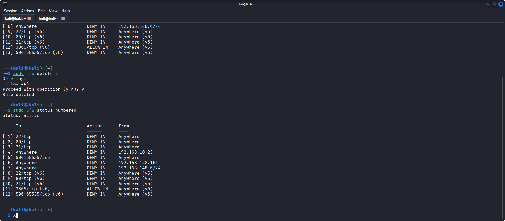

## Services Used:
_Services were started to test firewall rules realistically._

| Service | Port | Purpose |
|---------|------|---------|
| SSH | 22 | Remote login |
| HTTP(Apache) | 80 | Web server |
| FTP | 21 | File transfer |
## Tests:

__1. HTTP Test:__
_We can test http in our localhost system using the command __curl__ ._
```
curl localhost
```

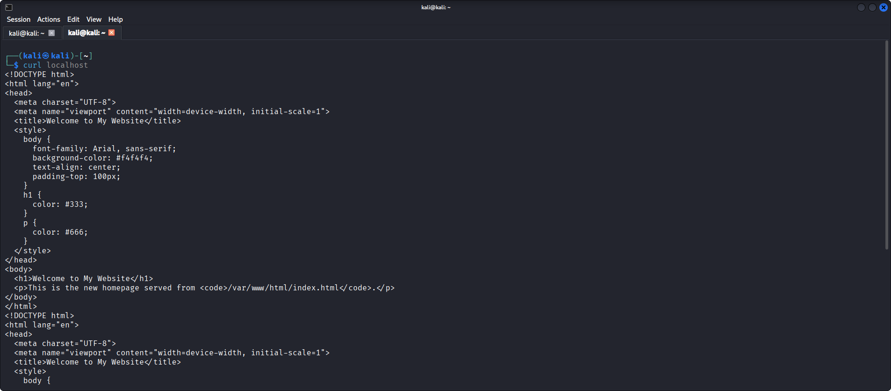
_It returns the raw HTML content of your localhost server meaning port 80 is allowed._

> __Note:__ Before testing the http,ensure that you have already started the web server in your system.

_If not ,start using this command:_
```
sudo systemctl start apache2
```


__2. SSH Test:__
_We can check ssh connection of our localhost using:_
```
ssh localhost 
```
_If the ssh is open we can able to see the banner of it._
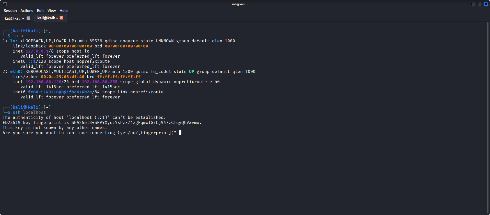
_As we can see ssh banner is visible which means port 22 is open._

__3. FTP Test:__
_Since we denied the FTP service we can't access it so it throws an error:_
> 
> `ftp: connect: Connection timed out`.

## Tests Performed:

| Test              | Result  |
| ----------------- | ------- |
| SSH Access        | Allowed |
| Web Server Access | Allowed |
| FTP Access        | Blocked |

## Live Monitoring and Logging:
```
sudo ufw logging on
sudo tail -f /var/log/ufw.log
```

> _Live logging and monitoring in UFW is useful mainly for visibility and troubleshooting. It helps you see which connections are being allowed or blocked in real time, making it easier to debug firewall rules and notice suspicious activity like repeated access attempts. However, it’s not a full security or intrusion-detection system and can generate noisy logs if used at high levels, so it’s best used temporarily or at a low log level for basic monitoring._


## Advantages of UFW:

- Easy to use.
- Lightweight.
- Real-time logging
- Effective for small servers and systems.

## Limitations:

- Basic firewall (not deep packet inspection)
- Limited GUI support
- Depends on correct rule configuration
---
# Conclusion:
This project successfully demonstrated how the UFW firewall can be configured, monitored, and tested to protect a Linux system from unauthorized access. On the positive side, UFW is simple to use, effective for basic security, and provides useful logging for monitoring and troubleshooting. However, its limitations include limited advanced threat detection and the potential for log noise at higher levels, making it unsuitable as a standalone solution for complex or large-scale security needs.
